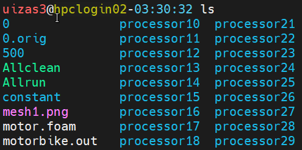
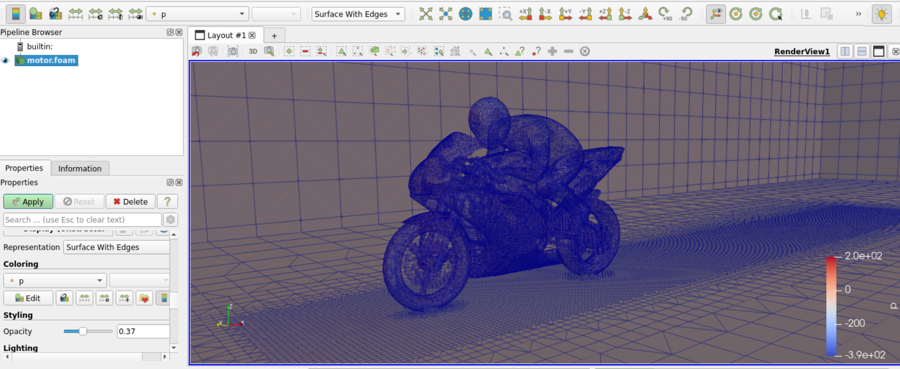
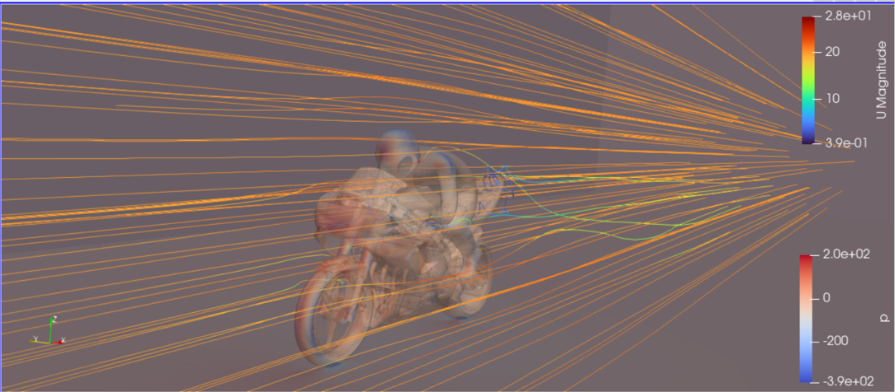

MotorBike example
==================

This page walks you through setting up and post process motorbike example within the OpenFOAM examples. 

Copying the example
-------------------

The first step in the motorbike case is to copy the case from the default Openfoam directory. 
See the following set of commands, that will

1. Load the OpenFoam module. 
2. Source the directory where tutorials are present
3. Allow you to copy this to your /home directory. 

.. code-block:: bash

    # This is first step
    module load openfoam-uoneasy/v2106-foss-2021a

    # This would be the second step
    source /gpfs01/software/easybuild-ada-uon/software/OpenFOAM/v2106-foss-2021a/OpenFOAM-v2106/etc/bashrc

    # This is the third step.
    echo $FOAM_TUTORIALS

If the last echo command provides with a path of the directory as follows, ``/gpfs01/software/easybuild-ada-uon/software/OpenFOAM/v2106-foss-2021a/OpenFOAM-v2106/tutorials/``, this means that the OpenFOAM module has been correctly loaded and the motorbike case can now be copied to your home directory. 

.. code-block:: bash

    # Go to the appropriate directory in your home account. say openfoamtutorial, you can copy the motorbike example as follows, from inside the openforamtutorial directory.

    cp -r $FOAM_TUTORIALS/incompressible/simpleFoam/motorBike/ .

Note that the ``.`` in the above command implies that the directory from the long specified path will be copied to the current directory. Learn more about linux basics for copying directorioes and files from `this link <https://linuxbasics-doc-uon.readthedocs.io/en/latest/>`_ 
Once the directory has been copied, you can see all the files present in the basic tutorial directory with the tree command as follows, 

.. code-block:: bash

    tree
    ## this outputs the following at the directory where motorBike directory is present
    `-- motorBike
    |-- 0.orig
    |   |-- U
    |   |-- include
    |   |   |-- fixedInlet
    |   |   |-- frontBackUpperPatches
    |   |   `-- initialConditions
    |   |-- k
    |   |-- nut
    |   |-- omega
    |   `-- p
    |-- Allclean
    |-- Allrun
    |-- constant
    |   |-- transportProperties
    |   `-- turbulenceProperties
    `-- system
        |-- blockMeshDict
        |-- controlDict
        |-- cuttingPlane
        |-- decomposeParDict.6
        |-- ensightWrite
        |-- forceCoeffs
        |-- fvSchemes
        |-- fvSolution
        |-- meshQualityDict
        |-- snappyHexMeshDict
        |-- streamLines
        |-- surfaceFeatureExtractDict
        |-- topoSetDict
        `-- wallBoundedStreamLines

    5 directories, 26 files

These indicate all the files that can be changed/edited and improved upon to run a ``incompressible`` case example using the ``simpleFoam`` solver. 

Mesh refinement
---------------

Default mesh for the motrobike example is set at 350k cells. 

If this mesh size is to be refined, it can be done from the system/blockMeshDict file as follows, 

.. code-block:: bash

    # change 
    blocks
    (
    hex (0 1 2 3 4 5 6 7) (20 8 8) simpleGrading (1 1 1)
    );

    # to
    blocks
    (
    hex (0 1 2 3 4 5 6 7) (40 16 16) simpleGrading (1 1 1)
    );

the second bracket for hex represents the mesh size in x,y and z direction respectively. Change the values accordingly to increase the cell count. 

SnappyHexMesh
^^^^^^^^^^^^^

There are many ways with which snappyHexMesh can be refined. 
The way this works is that it first meshes the box with blockMesh, and then defines the STL within that box. It then either keeps the part of the mesh that was cut out or the mesh that remains. It then smoothes the mesh at the STL surface. 

Incase a custom STL file is to be used, it needs to be placed in the ``constant/triSurface`` directory, and then the ``snappyHexMeshDict`` inside the system directory is to be changed accordingly. 

Boundary layers can be edited out or refined as per the requirement. 

Check this `blog <https://curiosityfluids.com/2019/02/14/high-level-overview-of-meshing-for-openfoam/>`_  to understand the high level overview around blockMesh (right hand rule) and hex-dominant meshing. 

Running the job
---------------

The following SLURM script will submit the job on the ``hmemq`` partition

.. tabs::
    
    .. code-tab:: slurm

            #!/bin/bash
            #SBATCH --job-name=motorbike
            #SBATCH --output=motorbike.out
            #SBATCH --time=2:00:00
            #SBATCH --nodes=1
            #SBATCH --ntasks-per-node=96
            #SBATCH --partition=hmemq

            # Load OpenFOAM module

            module load openfoam-uoneasy/v2106-foss-2021a-UCX-1.15.0

            #Set up OpenFOAM environment
            source /gpfs01/software/easybuild-ada-uon/software/OpenFOAM/v2106-foss-2021a/OpenFOAM-v2106/etc/bashrc

            surfaceFeatureExtract

            blockMesh

            decomposePar -copyZero

            mpirun -np $SLURM_NTASKS snappyHexMesh -parallel -overwrite >> motorbike.out

            mpirun -np $SLURM_NTASKS simpleFoam -parallel >> motorbike.out

            echo "=========================================" >> motorbike.out
            echo  >> motorbike.out
            echo " reconstruct starts here! " >> motorbike.out
            echo "=========================================" >> motorbike.out

            reconstructParMesh -constant >> motorbike.out

            reconstructPar -latestTime >> motorbike.out

As seen from the script
``surfaceFeatureExtract`` will extract the features and boundaries from the geometry definition within the blockMeshDict withing ``system/blockMeshDict``.

``blockMesh`` command will create the mesh file out of the same. 

``decomposePar`` command is used to partition the computation into manageble chunks to run them parallely. 

``snappyHexMesh`` then meshes the geometry definition. 

``simpleFoam`` command is the CFD solver. As this example is an external aerodyanamics example, this solver is classified under incompressibleFlows directory of the tutorial folder. 

``reconstructParMesh`` and ``reconstructPar`` then stitches togethre the final computation which was done in parallel. 

It is also important to highlight that in this example, one full node of *hmemq* partition has been used that has 96 cores. 

This is simply because 96 cores can handle small meshes (5-10M cell counts) quite easily. And staying with one full node, helps save some communication overheads that would be the case on using 2 nodes and 192 cores or under. 

All the results will be printed to the motorbike.out file which has been appended with the ``>>`` operator, implying an addition to the existing output in the motorbike.out file. 

Postprocessing with Paraview
============================

Visualization for OpenFOAM can be handled using visualization nodes as described in this `link <https://uniofnottm.sharepoint.com/sites/DigitalResearch/SitePages/Ada-Remote-Visualisation.aspx#mobaxterm>`_

The link describes the method to connect to the visualization cluster and open Paraview which is the defacto tool to visualize OpenFOAM projects. 

Once a visualization node has been opened, go to the appropriate directory from where the job was submitted using the ``cd`` command. 

create a dummy FOAM file by any name. In this case this is created as motor.foam seen from the image below, 

This foam file is then opened inside Paraview as follows, 

1. Open a terminal inside the visualization node. 
2. module load paraview-uoneasy/5.11.1-foss-2022a-mpi
3. source /gpfs01/software/easybuild-ada-uon/software/OpenFOAM/v2106-foss-2021a/OpenFOAM-v2106/etc/bashrc
4. vglrun paraview

This will open up Paraview session inside the visualization node. 

5. File -> Open -> motor.foam and then click on the eye symbol in the ``pipeline browser``, which will open up a cube like surface. 

6. Change the opacity and move around the bounding box to find the racer. For any post processing this pipeline browser can be looked at. 

Look at this `youtube video to understand user interaction of Paraview <https://www.youtube.com/watch?v=oeAVgkkD4Vg&list=PLvkU6i2iQ2fpcVsqaKXJT5Wjb9_ttRLK-&index=2>`_. 

Similarly various other post processing are possible within the paraview framework. 

The above image gives an example of creating strealines within the project for visualization. 
See this link to learn more about `paraview visualization <https://docs.paraview.org/en/latest/index.html>`_.